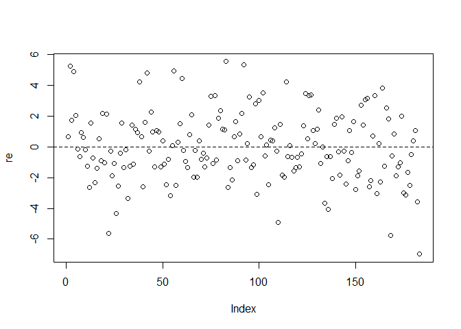
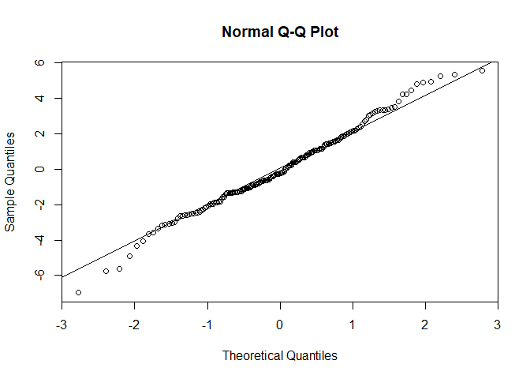

Modelowanie długości zdrowego życia na świecie za pomocą regresji
liniowej
================
Marcin Ćwiek
2025-01-14

## Opis teorii:

Analizy Regresji Liniowej to metoda statystyczna służąca do modelowania
zależności między zmienną objaśniającą a jedną lub wieloma zmiennymi
objaśniającymi. Jej celem jest oszacowanie równania, które pozwoli
przewidzieć wartości Y na podstawie wartości zmiennych niezależnych.

## Wymagane biblioteki:

``` r
library(readxl)
library(tseries)
library(knitr)
library(carData)
library(car)
```

## Wczytywanie danych:

``` r
dane <- read_excel("dane_projekt.xlsx")
head(dane, 10) # Fragment danych
```

    ## # A tibble: 10 × 11
    ##    Country              Y    X1    X2    X3    X4    X5    X6    X7    X8     X9
    ##    <chr>            <dbl> <dbl> <dbl> <dbl> <dbl> <dbl> <dbl> <dbl> <dbl>  <dbl>
    ##  1 Afghanistan       63.2   0.1   193    37   2.5   3.9   5.5  63.6    43 0.0353
    ##  2 Albania           78     6.8    15    62  18.8  10    21.7  19.3    94 0.668 
    ##  3 Algeria           77.1   0.6    59    75  17.2  10.7  27.4  34.1    74 0.422 
    ##  4 Andorra           84.1  12.3     3    77  33.3  16.5  25.6   9.5    93 4.21  
    ##  5 Angola            63.1   7.8   350    39   2.1   5.4   8.2  40.3    41 0.300 
    ##  6 Antigua and Bar…  76.5   9.4     2    72  27.7  11.3  18.9  21.1    78 1.89  
    ##  7 Argentina         76.6   9.5    31    73  40.6  15.5  28.3  12.3    71 1.39  
    ##  8 Armenia           76     4.7    23    69  44     5.7  20.2  45.5    94 0.677 
    ##  9 Australia         83    10.4     7    87  41.3  16.2  29     7.3    94 6.39  
    ## 10 Austria           81.6  11.9     5    82  52.9  15.7  20.1  12.9    84 5.20

## Opis danych:

Y - Oczekiwana długość zdrowego życia w chwili urodzenia w latach  
X1 - Całowie spożycie alkoholu na osobę ( ≥ 15 lat) w litrach czystego
alkoholu  
X2 - Przypadki gruźlicy na 100 tys. mieszkańców  
X3 - Wskaźnik dostępu do usług UHC (Universal Health Coverage - Narodowy
fundusz zdrowia) w %  
X4 - Liczba lekarzy na 10 tys. mieszkańców  
X5 - Aktualne wydatki Państwa na służbę zdrowia, % wszystkich wydatków
rządowych  
X6 - Odsetek występowania otyłości wśród osób dorosłych (18+ lat)  
X7 - Średnie roczne stężenia drobnych cząstek stałych pyłu (PM2,5) na
obszarach miejskich (µg/m3)  
X8 - Odsetek populacji, który otrzymał 2 dawki szczepionki na odrę  
X9 - PKB na osobę w 10,000\$  

## Wstępny model liniowy:

``` r
model1 <- lm(Y~X1+X2+X3+X4+X5+X6+X7+X8+X9, data = dane)
summary(model1)
```

    ## 
    ## Call:
    ## lm(formula = Y ~ X1 + X2 + X3 + X4 + X5 + X6 + X7 + X8 + X9, 
    ##     data = dane)
    ## 
    ## Residuals:
    ##     Min      1Q  Median      3Q     Max 
    ## -9.5164 -1.6464 -0.1534  1.5441  7.6249 
    ## 
    ## Coefficients:
    ##              Estimate Std. Error t value Pr(>|t|)    
    ## (Intercept) 54.621623   1.655217  33.000  < 2e-16 ***
    ## X1          -0.036880   0.065728  -0.561  0.57542    
    ## X2          -0.013370   0.001798  -7.435 3.91e-12 ***
    ## X3           0.266153   0.030104   8.841 7.82e-16 ***
    ## X4           0.051931   0.019376   2.680  0.00803 ** 
    ## X5           0.162629   0.060190   2.702  0.00754 ** 
    ## X6          -0.042316   0.020958  -2.019  0.04493 *  
    ## X7           0.012849   0.014450   0.889  0.37508    
    ## X8          -0.001889   0.011092  -0.170  0.86498    
    ## X9           0.231289   0.095526   2.421  0.01645 *  
    ## ---
    ## Signif. codes:  0 '***' 0.001 '**' 0.01 '*' 0.05 '.' 0.1 ' ' 1
    ## 
    ## Residual standard error: 2.819 on 183 degrees of freedom
    ## Multiple R-squared:  0.8538, Adjusted R-squared:  0.8466 
    ## F-statistic: 118.8 on 9 and 183 DF,  p-value: < 2.2e-16

Zmienne objaśniające X1, X7 oraz X8 nie posiadają istotnego wpływu na
zmienną objaśnianą. Wymagane jest przeprowadzenie wstecznej regresji
krokowej.

## Regresja krokowa w tył:

Krok 1: Tworzymy nowy model, pomijając zmienną X8, która charakteryzuje
się największą wartością p-value.

``` r
model2 <- lm(Y~X1+X2+X3+X4+X5+X6+X7+X9, data = dane)
summary(model2)
```

    ## 
    ## Call:
    ## lm(formula = Y ~ X1 + X2 + X3 + X4 + X5 + X6 + X7 + X9, data = dane)
    ## 
    ## Residuals:
    ##     Min      1Q  Median      3Q     Max 
    ## -9.5358 -1.5818 -0.1561  1.5626  7.5619 
    ## 
    ## Coefficients:
    ##              Estimate Std. Error t value Pr(>|t|)    
    ## (Intercept) 54.650728   1.642019  33.283  < 2e-16 ***
    ## X1          -0.035915   0.065310  -0.550  0.58304    
    ## X2          -0.013368   0.001794  -7.454 3.44e-12 ***
    ## X3           0.263455   0.025530  10.320  < 2e-16 ***
    ## X4           0.051766   0.019301   2.682  0.00798 ** 
    ## X5           0.163585   0.059770   2.737  0.00681 ** 
    ## X6          -0.042706   0.020777  -2.055  0.04125 *  
    ## X7           0.012764   0.014404   0.886  0.37669    
    ## X9           0.233528   0.094367   2.475  0.01424 *  
    ## ---
    ## Signif. codes:  0 '***' 0.001 '**' 0.01 '*' 0.05 '.' 0.1 ' ' 1
    ## 
    ## Residual standard error: 2.811 on 184 degrees of freedom
    ## Multiple R-squared:  0.8538, Adjusted R-squared:  0.8474 
    ## F-statistic: 134.3 on 8 and 184 DF,  p-value: < 2.2e-16

Krok 2: Nowy model nadal posiada nieistotne zmienne. W następnym kroku
usuwamy zmienną objaśniającą X1.

``` r
model3 <- lm(Y~X2+X3+X4+X5+X6+X7+X9, data = dane)
summary(model3)
```

    ## 
    ## Call:
    ## lm(formula = Y ~ X2 + X3 + X4 + X5 + X6 + X7 + X9, data = dane)
    ## 
    ## Residuals:
    ##     Min      1Q  Median      3Q     Max 
    ## -9.5250 -1.6319 -0.1964  1.6484  7.6514 
    ## 
    ## Coefficients:
    ##              Estimate Std. Error t value Pr(>|t|)    
    ## (Intercept) 54.467048   1.604654  33.943  < 2e-16 ***
    ## X2          -0.013409   0.001789  -7.496 2.64e-12 ***
    ## X3           0.262941   0.025465  10.326  < 2e-16 ***
    ## X4           0.049069   0.018632   2.634  0.00916 ** 
    ## X5           0.159417   0.059175   2.694  0.00771 ** 
    ## X6          -0.040457   0.020332  -1.990  0.04808 *  
    ## X7           0.015140   0.013715   1.104  0.27107    
    ## X9           0.231318   0.094104   2.458  0.01489 *  
    ## ---
    ## Signif. codes:  0 '***' 0.001 '**' 0.01 '*' 0.05 '.' 0.1 ' ' 1
    ## 
    ## Residual standard error: 2.806 on 185 degrees of freedom
    ## Multiple R-squared:  0.8536, Adjusted R-squared:  0.848 
    ## F-statistic:   154 on 7 and 185 DF,  p-value: < 2.2e-16

Krok 3: Usuwamy zmienną X7, wartość jej p-value przekracza zadany poziom
istotności α = 0.05.

``` r
model4 <- lm(Y~X2+X3+X4+X5+X6+X9, data = dane)
summary(model4)
```

    ## 
    ## Call:
    ## lm(formula = Y ~ X2 + X3 + X4 + X5 + X6 + X9, data = dane)
    ## 
    ## Residuals:
    ##     Min      1Q  Median      3Q     Max 
    ## -9.5390 -1.4604 -0.1344  1.6572  7.9361 
    ## 
    ## Coefficients:
    ##              Estimate Std. Error t value Pr(>|t|)    
    ## (Intercept) 55.422015   1.352295  40.984  < 2e-16 ***
    ## X2          -0.013638   0.001778  -7.672  9.2e-13 ***
    ## X3           0.260372   0.025373  10.262  < 2e-16 ***
    ## X4           0.046864   0.018536   2.528   0.0123 *  
    ## X5           0.141392   0.056911   2.484   0.0139 *  
    ## X6          -0.045489   0.019826  -2.294   0.0229 *  
    ## X9           0.226833   0.094071   2.411   0.0169 *  
    ## ---
    ## Signif. codes:  0 '***' 0.001 '**' 0.01 '*' 0.05 '.' 0.1 ' ' 1
    ## 
    ## Residual standard error: 2.808 on 186 degrees of freedom
    ## Multiple R-squared:  0.8526, Adjusted R-squared:  0.8478 
    ## F-statistic: 179.3 on 6 and 186 DF,  p-value: < 2.2e-16

Każda zmienna objaśniająca posiada p-value \< 0.05, oznacza to że każda
z nich posiada istotny wpływ na zmienną objaśniającą. Na tym kroku
zakończymy regresje krokową w tył.

## Diagnostyka dopasowania modelu:

Poszukujemy obserwacji wpływowych, które znacznie wpływają na
dopasowanie modelu.

``` r
dffits <- dffits(model4)
wplywowe <- which(abs(dffits) > 2*sqrt(7/193))
```

Obserwacje wpływowe: 14, 40, 44, 59, 64, 74, 92, 97, 133, 136, 172.

Następnie szukamy obserwacji odstających, nie pasujących do wzorca
sugerowanego przez pozostałe punkty. Posiadających nietypową wartość
zmiennej objaśnianej Y.

``` r
rstud <- rstandard(model4)
odstajace <- which(abs(rstud) > 2)
```

Obserwacje odstające: 14, 23, 40, 59, 74, 92, 97, 133, 136, 172, 178,
193.

Na koniec szukamy obserwacji dźwigniowych:

``` r
hatv <- hatvalues(model4)
dzwigniowe <- which(hatv > 2*7/193)
```

Obserwacje dźwigniowe: 40, 44, 47, 83, 87, 91, 97, 101, 108, 113, 114,
120, 131, 149, 161, 179.

Na zakończenie usuwamy obserwacje, które są wpływowe i dźwigniowe lub
odstające.

``` r
nietypowe <- which((1:193 %in% wplywowe) & ((1:193 %in% dzwigniowe) | (1:193 %in% odstajace)))
dane2 <- dane[-nietypowe, ]
```

Usunięte obserwacje: 14, 40, 44, 59, 74, 92, 97, 133, 136, 172.

Z nowo otrzymanego zestawu danych tworzymy nowy model regresji liniowej.

``` r
model5 <- lm(Y~X2+X3+X4+X5+X6+X9, data = dane2)
summary(model5)
```

    ## 
    ## Call:
    ## lm(formula = Y ~ X2 + X3 + X4 + X5 + X6 + X9, data = dane2)
    ## 
    ## Residuals:
    ##     Min      1Q  Median      3Q     Max 
    ## -6.9742 -1.3356 -0.2472  1.4288  5.5274 
    ## 
    ## Coefficients:
    ##             Estimate Std. Error t value Pr(>|t|)    
    ## (Intercept) 54.60175    1.12517  48.528  < 2e-16 ***
    ## X2          -0.01349    0.00163  -8.279 3.01e-14 ***
    ## X3           0.27144    0.02126  12.770  < 2e-16 ***
    ## X4           0.04720    0.01622   2.911  0.00407 ** 
    ## X5           0.17160    0.04663   3.680  0.00031 ***
    ## X6          -0.05567    0.01695  -3.284  0.00124 ** 
    ## X9           0.18060    0.07774   2.323  0.02132 *  
    ## ---
    ## Signif. codes:  0 '***' 0.001 '**' 0.01 '*' 0.05 '.' 0.1 ' ' 1
    ## 
    ## Residual standard error: 2.274 on 176 degrees of freedom
    ## Multiple R-squared:  0.899,  Adjusted R-squared:  0.8956 
    ## F-statistic: 261.2 on 6 and 176 DF,  p-value: < 2.2e-16

## Ocena modeli:

Ocena utworzonych modeli na podstawie kryteriów Akaike oraz BIC.

``` r
suppressWarnings(AIC(model1, model2, model3, model4, model5))
```

    ##        df      AIC
    ## model1 11 959.4407
    ## model2 10 957.4713
    ## model3  9 955.7883
    ## model4  8 955.0554
    ## model5  8 828.9266

``` r
suppressWarnings(BIC(model1, model2, model3, model4, model5))
```

    ##        df      BIC
    ## model1 11 995.3303
    ## model2 10 990.0982
    ## model3  9 985.1525
    ## model4  8 981.1569
    ## model5  8 854.6025

Model 5 osiągnięty w wyniku regresji wstecznej oraz usunięciu
nietypowych obserwacji posiada najmniejszą wartości dla obu kryteriów.
Oznacza to, że najlepiej dopasowuje się do danych spośród porównywanych
modeli.

## Postać modelu:

Postać teoretyczna modelu:  y = β0 + β2x2 + β3x3 + β4x4 + β5x5 + β6x6 +
β9x9 + ε  

Postać oszacowana modelu: y^ = b0 + b2x2 + b3x3 + b4x4 + b5x5 + b6x6 +
b9x9

y^ = 54.602 - 0.013*x2 + 0.271*x3 + 0.047*x4 + 0.172*x5 - 0.056*x6 +
0.181*x9

## Interpretacja parametrów:

Wszystkie interpretacje zakładają, że wartość pozostałych zmiennych
pozostanie bez zmian.

b2 - Jeśli ilość przypadków gruźlicy wzrośnie o 1 osobę na 100tyś
mieszkańców, to przewidywana długość zdrowego życia w chwili urodzenia
spadnie średnio o 0.013 roku.

b3 - Jeśli wartość wskaźnika dostępu do usług UHC wzrośnie o 1%, to
przewidywana długość zdrowego życia w chwili urodzenia wzrośnie o
średnio 0.271 roku.

b4 - Jeśli ilość lekarzy na 10tyś mieszkańców wzrośnie o 1 jednostkę, to
przewidywana długość zdrowego życia w chwili urodzenia wzrośnie o
średnio 0.047 roku.

b5 - Jeśli wartość wydatków rządowych na służbę zdrowia wzrośnie o 1%,
to przewidywana długość zdrowego życia w chwili urodzenia wzrośnie o
średnio 0.172 roku.

b6 - Jeśli odsetek występowania otyłości wśród dorosłych zwiększy się o
1%, to przewidywana długość zdrowego życia w chwili urodzenia spadnie o
średnio 0.056 roku.

b9 - Jeśli średnia wartość PKB na osobę wzrośnie o 10000\$, to
przewidywana długość zdrowego życia w chwili urodzenia wzrośnie o
średnio 0.181 roku

## Dopasowanie modelu:

Współczynnik determinacji R² = 0.8990281. Oznacza to, że 90% zmienności
zmiennej zależnej jest wyjaśniona przez zmienne niezależne.

## Badanie normalności:

``` r
re <- resid(model5)
plot(re);abline(h=0,lty=2)
```

<!-- -->

``` r
qqnorm(re);qqline(re)
```

<!-- -->

Reszty na pierwszym wykresie są losowo rozproszone wokół osi, nie tworzą
żadnej widocznej struktury. Punkty na wykresie QQ nie odbiegają w
znaczący sposób od prostej. Na podstawie wykresów możemy założyć, że
reszty posiadają rozkład normalny oraz dane zostały poprawnie dobrane do
naszego modelu. Dla pewności wykonujemy dodatkowo test Jarque-Bery.

``` r
jarque.bera.test(re)
```

    ## 
    ##  Jarque Bera Test
    ## 
    ## data:  re
    ## X-squared = 0.43873, df = 2, p-value = 0.803

H0: Reszty pochodzą z populacji o rozkładzie normalnym  
H1: Reszty nie pochodzą z populacji o rozkładzie normalnym  

p-value = 0.803, oznacza to, że nie ma podstaw do odrzucenia hipotezy
zerowej o rozkładzie normalnym reszt.

## Badanie współliniowości

``` r
vif(model5)
```

    ##       X2       X3       X4       X5       X6       X9 
    ## 1.496010 3.788013 2.720345 1.959553 1.196340 1.671101

Żadna ze zmiennych nie posiada wartości VIF \> 5. Oznacza to, że model
jest stabilny oraz nie wymaga wprowadzenia dodatkowych poprawek.

## Wnioski praktyczne

Wyniki sugerują, że zwiększenie wydatków na opiekę zdrowotną i liczby
lekarzy może istotnie wydłużyć zdrowe życie. Natomiast wysoki poziom
otyłości jest silnie oraz negatywnie skorelowany z oczekiwaną długością
zdrowego życia, co podkreśla konieczność działań prewencyjnych.
